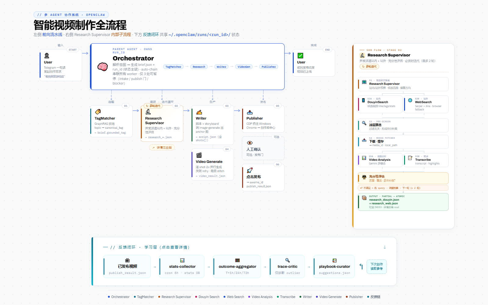

# VideoClaw

一套基于 [OpenClaw](https://openclaw.ai) 的多 Agent 短视频生产系统 —— 把"想做个视频"到"视频已发布"之间的所有环节（选题、调研、写稿、生成、发布、复盘）拆给一组专职 agent 协同完成。

这是在 Deep Learning 实验室的支持下做出来的探索性项目。出发点很朴素：现在做一条短视频要跑很多零散环节，想稳定、批量地产出时人工瓶颈很明显。我们想看看能不能把整条流程整合进一套自动化体系，并在每次产出后通过表现反馈持续微调 —— 算是为短视频自动化生产这个方向积累一点可复用的工程实践。

https://github.com/yangyuhang2003-netizen/VideoClaw

## 🎯 设计上最看重的一点：越用越懂你

整套系统不只是"自动跑完一条流水线"。每条已发布视频的播放、点赞、评论、分享、收藏数据都会被持续追踪，沉淀进下一轮选题与脚本生成的决策里 —— **让系统在使用过程中逐步形成对使用者内容方向的理解，而不是每次都从零开始**。

跑得越多，VideoClaw 越知道：

- 在你的赛道里，什么样的开头更容易被划走、什么样的节奏更容易留人
- 哪些标签 / 角度 / 镜头组合在你这边历史表现更好
- 哪些选题尝试过且效果一般，下一轮可以避开

## 🔁 用户视角

通过 Telegram 或 WhatsApp 发一句话题，剩下的事 VideoClaw 自动跑完：

- ✅ 话题理解与调研（抖音热门候选 + 网络背景资料）
- ✅ 脚本生成（含多分镜故事板与旁白）
- ✅ 视频生成（多分镜并行 + 服务端自动拼接）
- ✅ 发布到抖音
- ✅ 表现数据收集 → 周报 → 反哺下一轮创作

---

> 💬 作者 **Yuhang Yang** 与 **Xinyue Pan** 目前正在寻找工作机会（AI Agent / 多模态生产 / 自动化产品 方向），也欢迎对项目本身或相关方向感兴趣的朋友邮件交流 —— yangyuhang2003@gmail.com / panxinyue10@gmail.com

---

## 系统架构

<p align="center">
  <a href="https://yangyuhang2003-netizen.github.io/videoclaw-page/">
    
  </a>
  <br/>
  <em>📐 点击查看交互式架构图</em>
</p>

## Demo

https://github.com/user-attachments/assets/3b3042d5-7f29-4984-b1f8-fa7c15a70c97

> 用户在 Telegram 发了一句 **`请你给我做一个户外美食相关的30秒左右的视频吧`**，VideoClaw 全程自动跑完整条流水线，几分钟后把成片送回 —— **中途不需要任何人工确认**。

|  |  |
| --- | --- |
| 🗣️ **用户输入** | `请你给我做一个户外美食相关的30秒左右的视频吧` |
| 🎞️ **视频生成模型** | **MiniMax-Hailuo-02**（image-to-video） |
| 🧩 **生成方式** | 5 个分镜 × 6 秒 = 30 秒成片，服务端 ffmpeg 自动拼接 |
| 🔁 **完整流水线** | `tag-matcher → research-supervisor (douyin + web) → writer → video-generate → publisher` |

---

## 系统组成

整个系统分为三部分：**OpenClaw 多 Agent 流水线** + **外部 HTTP 服务** + **数据反馈闭环**。

### 第一部分 — OpenClaw 多 Agent 流水线

由 `orchestrator` 统一调度的专职 agent 链，**全程自动推进** —— 每个 worker 完成后立即触发下一个，无需用户在 step 之间确认：

```
用户请求（Telegram / WhatsApp）
  → orchestrator         ← 总协调，参考历史周报做决策
  → tag-matcher          ← 把话题 ground 到具体抖音标签
  → research-supervisor  ← 规划调研、并发调度子 agent
    ├── douyin-search    ← 检索候选抖音视频
    └── web-search       ← 搜集网络背景资料
  → writer               ← 生成完整脚本（多镜头故事板 + 旁白）
  → video-generate       ← 并行生成所有分镜 → ffmpeg 拼接
  → publisher            ← 自动上传发布到抖音创作者中心（仅 publish 模式）
```

只在三种情形下停下来等用户：(1) 初次 brief 缺关键信息、(2) 发布闸门确认、(3) 不可恢复的 blocker。

### 第二部分 — 外部 HTTP 服务（`agent-service/`）

Python FastAPI 后端，供 OpenClaw 插件调用：

- 抓取并分析抖音视频（Douyin cookies + Gemini）
- 视频音频转写（Gemini）
- 视频生成（MiniMax Hailuo 或字节跳动 Seedance/Ark）
- 多分镜视频自动拼接（服务端 ffmpeg）
- 提供 GraphRAG 标签知识库查询
- 存储和查询视频表现数据
- 接收飞书机器人事件回调，并通过统一 Message Adapter 转交给现有 OpenClaw orchestrator（详见 [docs/FEISHU_ADAPTER.md](docs/FEISHU_ADAPTER.md)）

### 第三部分 — 数据反馈闭环

每条已发布视频会被持续追踪，表现数据回灌进下一轮生产决策：

```
已发布视频
  → stats-collector（每 6 小时）   ← 抓取播放/点赞/评论/分享/收藏，写入 SQLite
  → stats-analyzer（每周一 9:00）  ← 读库、分析、生成周报
  → orchestrator                   ← 读周报，作为下一次选题/脚本/生成的参考
```

这条闭环让系统**越用越懂你的内容方向**，而不是每次从零开始。

---

## 前置条件

- 已安装 [OpenClaw](https://openclaw.ai)
- Python 3.10+
- **抖音账号**（需要 cookies 用于视频抓取）
- **Google Gemini API Key**（转写 + 视频分析）
- 至少一个**视频生成 API Key**：MiniMax Hailuo 或字节跳动 Ark（Seedance）
- **Telegram Bot** 和/或 **WhatsApp 账号**
- _(可选)_ **Windows 节点**（用于浏览器操作抖音创作者中心发布）— 详见 [docs/BROWSER.md](docs/BROWSER.md)

---

## 快速开始

### 第一步 — 克隆仓库

克隆到 OpenClaw 目录（默认 `~/.openclaw`）：

```bash
git clone https://github.com/yangyuhang2003-netizen/videoclaw.git ~/.openclaw
cd ~/.openclaw
```

### 第二步 — 启动外部服务

外部服务需要在 OpenClaw 启动之前先跑起来。

```bash
cd agent-service
pip install -r requirements.txt
```

复制并填写配置：

```bash
cp .env.example .env
# 编辑 .env，填入 API Key 等配置
```

将抖音 cookies 放入 `config/douyin_cookies.txt`（Netscape 格式，从浏览器导出）。

构建标签知识库（仅首次需要）：

```bash
cd video-agent-system/tag_knowledge_db
# 详见 tag_knowledge_db/README.md
```

启动服务：

```bash
cd agent-service
uvicorn app.main:app --host 127.0.0.1 --port 8000
```

**Windows 用户**可以用快捷脚本（先修改脚本顶部的路径变量）：

```powershell
powershell .\kill_restart.ps1
```

验证服务正常运行：

```bash
curl http://localhost:8000/health
```

### 第三步 — 配置 OpenClaw

回到仓库根目录：

```bash
./setup.sh
```

脚本会根据你的安装路径自动生成 `openclaw.json`，之后手动填写以下占位符：

| 占位符 | 填写内容 |
|---|---|
| `YOUR_TELEGRAM_BOT_TOKEN` | 通过 [@BotFather](https://t.me/BotFather) 创建 |
| `YOUR_TELEGRAM_USER_ID` | 你的 Telegram 用户 ID（格式：`tg:12345678`） |
| `YOUR_WHATSAPP_NUMBER` | 含国家代码的手机号，如 `+8613800000000` |
| `YOUR_GATEWAY_AUTH_TOKEN` | 任意随机字符串 |
| `YOUR_VIDEO_SERVICE_HOST` | 运行外部服务的机器 IP（第二步中的服务） |

### 第四步 — 安装插件

```bash
cd openclaw-plugins/video-http-tools
npm install
npm run build
```

### 第五步 — 启动 OpenClaw

```bash
openclaw start
```

向 Telegram Bot 或 WhatsApp 发送一个话题，流水线即刻启动。

---

## Windows 节点配置（抖音发布）

如果你在 WSL 上运行 OpenClaw 并需要浏览器操作抖音创作者中心发布，需要将 Windows 作为浏览器节点接入 OpenClaw，详见 [docs/BROWSER.md](docs/BROWSER.md)。

如果你使用 macOS 或不需要创作者中心发布功能，跳过此步骤即可。

---

## 项目结构

```
├── agent-service/                # Python FastAPI 后端（外部 HTTP 服务）
│   ├── app/
│   │   ├── providers/            # 集成：Gemini、MiniMax、Seedance、Douyin
│   │   ├── routes/               # API 路由
│   │   ├── services/             # 业务逻辑
│   │   ├── schemas/              # 请求/响应模型
│   │   └── infra/                # 数据库、异常、响应格式化
│   ├── video-agent-system/
│   │   ├── src/                  # 抖音视频采集流水线
│   │   └── tag_knowledge_db/     # GraphRAG 标签知识库构建工具
│   ├── .env.example              # 配置模板
│   └── kill_restart.ps1          # Windows 重启脚本
│
├── openclaw-plugins/
│   └── video-http-tools/         # 封装 HTTP 服务的 OpenClaw 插件
│
├── workspace-orchestrator/       # 总协调 agent
├── workspace-tag-matcher/        # 标签 grounding agent
├── workspace-research-supervisor/# 调研协调 agent
├── workspace-douyin-search/      # 抖音搜索 agent
├── workspace-web-search/         # 网络调研 agent
├── workspace-writer/             # 脚本写作 agent
├── workspace-video-generate/     # 视频生成 agent
├── workspace-publisher/          # 抖音创作者中心发布 agent
├── workspace-stats-collector/    # 数据采集 agent
├── workspace-stats-analyzer/     # 周报分析 agent
├── workspace/                    # 主 agent workspace
│
├── docs/                         # 架构文档
├── cron/                         # 定时任务配置
├── openclaw.example.json         # OpenClaw 配置模板
└── setup.sh                      # 初始化脚本（生成 openclaw.json）
```

---

## 文档

- [docs/PIPELINE.md](docs/PIPELINE.md) — 完整流水线与数据流
- [docs/RUN_LAYOUT.md](docs/RUN_LAYOUT.md) — Run 目录结构
- [docs/ASYNC_JOBS.md](docs/ASYNC_JOBS.md) — 异步任务处理
- [docs/BROWSER.md](docs/BROWSER.md) — Windows 浏览器节点协议
- [docs/PRINCIPLES.md](docs/PRINCIPLES.md) — Agent 共用行为准则
- [agent-service/API_documents.txt](agent-service/API_documents.txt) — 外部服务 API 文档
- [agent-service/video-agent-system/tag_knowledge_db/README.md](agent-service/video-agent-system/tag_knowledge_db/README.md) — 标签知识库构建指南

---

## Acknowledgements

This project would like to sincerely thank the following individuals for their valuable guidance, support, and encouragement:

- **Ruotong Wang** (wrt.ojt@gmail.com)
- **Jian Kang** (jian.kang@mbzuai.ac.ae)
- **Kenji Kawaguchi** (kenji@comp.nus.edu.sg)

### Development Contributors

This project was developed with contributions from:

- **Yuhang Yang** (yangyuhang2003@gmail.com)
- **Xinyue Pan** (panxinyue10@gmail.com)
- **Haonan Wang** (haonan.wang@u.nus.edu)
